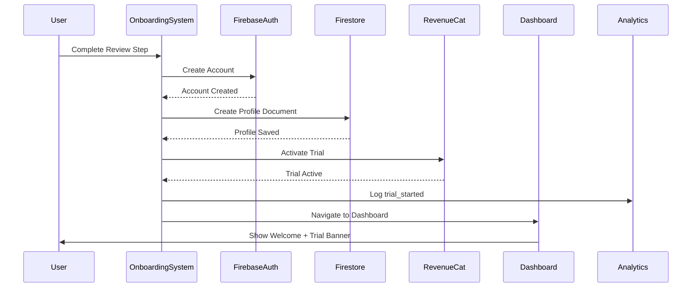

# Onboarding System Design Document

## Overview

The Onboarding System is a comprehensive 5+ step mobile-first flow that guides new users through profile creation, personalization, and account setup. Built with React Native + Expo Router, the system collects essential user data, ensures legal compliance, and seamlessly transitions users into their 7-day trial experience.

The design prioritizes user experience with clear progress indication, data persistence, and accessibility while maintaining strict compliance with COPPA/GDPR-K requirements for minor users.

## Architecture

### Navigation Structure
```
/onboarding/
├── index.tsx           # Entry point & step router
├── [step].tsx          # Dynamic step component
├── components/
│   ├── StepWrapper.tsx     # Common step layout
│   ├── ProgressBar.tsx     # Progress indication
│   ├── NavigationBar.tsx   # Back/Next controls
│   └── steps/
│       ├── RoleSelection.tsx
│       ├── SportGender.tsx
│       ├── PositionLevel.tsx
│       ├── TeamDetails.tsx
│       ├── GoalSelection.tsx
│       ├── AthleteDNA.tsx
│       ├── TonePreference.tsx
│       ├── AgeVerification.tsx
│       ├── LegalConsent.tsx
│       ├── ReviewProfile.tsx
│       └── AccountCreation.tsx
└── hooks/
    ├── useOnboardingState.ts
    ├── useStepValidation.ts
    └── useProgressPersistence.ts
```

### State Management Architecture
```typescript
// Zustand store structure
interface OnboardingStore {
  // Current state
  currentStep: number
  totalSteps: number
  isLoading: boolean
  
  // User data
  profile: OnboardingProfile
  
  // Progress tracking
  completedSteps: Set<number>
  validationErrors: Record<string, string[]>
  
  // Actions
  setStep: (step: number) => void
  updateProfile: (data: Partial<OnboardingProfile>) => void
  validateStep: (step: number) => boolean
  saveProgress: () => Promise<void>
  resetOnboarding: () => void
}

interface OnboardingProfile {
  // Step 1: Role
  role: 'athlete' | 'coach'
  
  // Step 2: Sport & Demographics
  sport: string
  gender: 'male' | 'female'
  dateOfBirth: Date
  graduationYear: number
  
  // Step 3: Position & Level
  position: string
  academicLevel: 'freshman' | 'jv' | 'varsity'
  
  // Step 4: Team Details
  teamType: 'high_school' | 'club'
  school: {
    name: string
    city: string
    state: string
  }
  club?: {
    organization: string
    teamName: string
  }
  
  // Step 5: Goals
  selectedGoals: string[] // exactly 3
  
  // Step 6: AthleteDNA
  dna: {
    motivation: string
    confidence: string
    focusMode: string
    competitiveness: string
    coachability: string
    resilience: string
  }
  
  // Step 7: AI Tone
  aiTone: 'hype' | 'mentor' | 'analyst' | 'captain'
  
  // Step 8: Age Verification (if needed)
  ageVerified: boolean
  guardianEmail?: string
  consentTimestamp?: Date
  
  // Step 9: Legal
  tosAccepted: boolean
  privacyAccepted: boolean
  benchmarkingConsent: boolean
  
  // Metadata
  onboardingStarted: Date
  onboardingCompleted?: Date
  trialActivated?: boolean
}
```

## Components and Interfaces

### Core Components

#### StepWrapper Component
```typescript
interface StepWrapperProps {
  stepNumber: number
  title: string
  subtitle?: string
  children: React.ReactNode
  onNext?: () => void
  onBack?: () => void
  nextDisabled?: boolean
  showProgress?: boolean
}
```

**Responsibilities:**
- Consistent layout and styling across all steps
- Progress bar integration
- Navigation controls
- Accessibility labels and focus management
- Loading states and error handling

#### ProgressBar Component
```typescript
interface ProgressBarProps {
  currentStep: number
  totalSteps: number
  completedSteps: Set<number>
  variant?: 'linear' | 'circular'
}
```

**Features:**
- Visual progress indication
- Step completion status
- Smooth animations between steps
- Accessibility announcements for progress changes

### Step-Specific Components

#### RoleSelection (Step 1)
- Large, clear role cards (Athlete/Coach)
- Role-specific imagery and descriptions
- Immediate validation and progression

#### SportGender (Step 2)
- Sport selection (lacrosse primary, expandable)
- Gender selection with inclusive options
- Date of birth picker with age calculation
- Graduation year dropdown (2025-2029)

#### PositionLevel (Step 3)
- Dynamic position options based on sport/gender
- Academic level selection (Freshman/JV/Varsity)
- Position-specific descriptions and imagery

#### TeamDetails (Step 4)
- School name autocomplete with validation
- City/State selection with geolocation option
- Club team toggle with conditional fields
- Team logo/colors selection (future enhancement)

#### GoalSelection (Step 5)
- Position-specific goal categories
- Exactly 3 goal selection with visual feedback
- Goal descriptions and success metrics
- Drag-to-reorder selected goals

#### AthleteDNA (Step 6)
- Six personality assessment questions
- Slider-based or multiple choice responses
- Progress indication within the quiz
- Personality type preview based on responses

#### TonePreference (Step 7)
- Four AI tone options with sample messages
- Interactive preview of each tone style
- Personality-based recommendations from DNA results

#### AgeVerification (Step 8)
- Age calculation and compliance checking
- Guardian email collection for 13-15 year olds
- COPPA/GDPR-K compliance messaging
- Parental consent workflow

#### LegalConsent (Step 9)
- Terms of Service and Privacy Policy links
- Required consent checkboxes
- Optional benchmarking data consent
- Clear legal language and explanations

#### ReviewProfile (Step 10)
- Complete profile summary
- Edit links to previous steps
- Data accuracy confirmation
- Account creation initiation

### Data Models

#### Firestore Schema
```typescript
// Collection: users/{userId}
interface UserProfile {
  // Identity
  id: string
  email: string
  role: 'athlete' | 'coach'
  
  // Demographics
  sport: string
  gender: 'male' | 'female'
  dateOfBirth: Timestamp
  graduationYear: number
  
  // Athletic Info
  position: string
  academicLevel: 'freshman' | 'jv' | 'varsity'
  teamType: 'high_school' | 'club'
  
  // Organizations
  school: SchoolInfo
  club?: ClubInfo
  
  // Goals & Personalization
  goals: Goal[]
  athleteDNA: AthleteDNA
  aiTone: AITone
  
  // Compliance
  ageVerified: boolean
  guardianEmail?: string
  consentTimestamp?: Timestamp
  tosAcceptedVersion: string
  privacyAcceptedVersion: string
  benchmarkingConsent: boolean
  
  // Trial & Subscription
  trialStartDate?: Timestamp
  trialStatus: 'active' | 'expired' | 'converted'
  subscriptionStatus?: string
  
  // Metadata
  createdAt: Timestamp
  updatedAt: Timestamp
  onboardingCompletedAt: Timestamp
  lastActiveAt: Timestamp
}

interface SchoolInfo {
  name: string
  city: string
  state: string
  type: 'public' | 'private' | 'charter'
}

interface ClubInfo {
  organization: string
  teamName: string
  league?: string
}

interface Goal {
  id: string
  category: string
  title: string
  targetValue: number
  currentValue: number
  unit: string
  deadline?: Timestamp
}

interface AthleteDNA {
  motivation: 'intrinsic' | 'extrinsic' | 'balanced'
  confidence: 'high' | 'moderate' | 'building'
  focusMode: 'intense' | 'steady' | 'burst'
  competitiveness: 'high' | 'moderate' | 'collaborative'
  coachability: 'high' | 'moderate' | 'independent'
  resilience: 'high' | 'moderate' | 'developing'
  completedAt: Timestamp
}
```

## Error Handling

### Validation Strategy
```typescript
interface ValidationRule {
  field: string
  required?: boolean
  minLength?: number
  maxLength?: number
  pattern?: RegExp
  custom?: (value: any) => string | null
}

// Step-specific validation rules
const stepValidations: Record<number, ValidationRule[]> = {
  1: [{ field: 'role', required: true }],
  2: [
    { field: 'sport', required: true },
    { field: 'gender', required: true },
    { field: 'dateOfBirth', required: true, custom: validateAge },
    { field: 'graduationYear', required: true }
  ],
  // ... additional step validations
}
```

### Error Recovery
- **Network Failures**: Automatic retry with exponential backoff
- **Validation Errors**: Inline error messages with correction guidance
- **Age Compliance**: Clear redirection to guardian signup flow
- **Data Loss**: Automatic progress saving every 30 seconds
- **Authentication Errors**: Clear error messages with retry options

### Offline Support
- Local storage backup of all onboarding data
- Sync queue for when connectivity returns
- Offline-first validation where possible
- Clear offline status indicators

## Testing Strategy

### Unit Testing
- **Component Testing**: Each step component with various data states
- **Validation Testing**: All validation rules and edge cases
- **State Management**: Zustand store actions and state transitions
- **Utility Functions**: Age calculation, data formatting, validation helpers

### Integration Testing
- **Step Navigation**: Forward/backward navigation with data persistence
- **Form Validation**: End-to-end validation across all steps
- **Firebase Integration**: Profile creation and data storage
- **RevenueCat Integration**: Trial activation flow

### Accessibility Testing
- **Screen Reader**: VoiceOver/TalkBack navigation and announcements
- **Keyboard Navigation**: Tab order and focus management
- **Color Contrast**: WCAG AA compliance across all components
- **Dynamic Type**: Text scaling and layout adaptation

### Performance Testing
- **Bundle Size**: Lazy loading of step components
- **Memory Usage**: State cleanup and component unmounting
- **Network Efficiency**: Minimal API calls and data compression
- **Animation Performance**: 60fps animations on lower-end devices

## Security Considerations

### Data Protection
- **Encryption**: All sensitive data encrypted in transit and at rest
- **PII Handling**: Minimal collection and secure storage of personal information
- **Age Verification**: COPPA-compliant data handling for minors
- **Consent Management**: Granular consent tracking and withdrawal options

### Authentication Security
- **Password Requirements**: Strong password validation
- **Email Verification**: Required before account activation
- **Rate Limiting**: Protection against brute force attacks
- **Session Management**: Secure token handling and expiration

### Privacy Compliance
- **Data Minimization**: Only collect necessary information
- **Consent Granularity**: Separate consent for different data uses
- **Right to Deletion**: Account and data deletion capabilities
- **Cross-Border Transfer**: GDPR-compliant data handling

## Performance Optimizations

### Code Splitting
```typescript
// Lazy load step components
const RoleSelection = lazy(() => import('./steps/RoleSelection'))
const SportGender = lazy(() => import('./steps/SportGender'))
// ... other steps

// Preload next step component
const preloadNextStep = (currentStep: number) => {
  const nextStepComponent = getStepComponent(currentStep + 1)
  if (nextStepComponent) {
    import(nextStepComponent.path)
  }
}
```

### Data Optimization
- **Incremental Saving**: Save data after each step completion
- **Compression**: Compress large data objects before storage
- **Caching**: Cache static data (positions, goals) locally
- **Debouncing**: Debounce validation and auto-save operations

### Animation Performance
- **Native Driver**: Use native animated driver where possible
- **Layout Animations**: Minimize layout thrashing during transitions
- **Image Optimization**: Lazy load and compress step imagery
- **Memory Management**: Cleanup animations on component unmount

## Analytics Integration

### Event Tracking
```typescript
interface OnboardingAnalytics {
  // Flow events
  onboarding_started: { timestamp: Date, source: string }
  step_completed: { step: number, duration: number }
  step_abandoned: { step: number, duration: number }
  
  // Interaction events
  goal_selected: { goalId: string, category: string }
  tone_previewed: { tone: string, duration: number }
  dna_question_answered: { questionId: string, answer: string }
  
  // Completion events
  onboarding_completed: { totalDuration: number, stepCount: number }
  trial_activated: { timestamp: Date, method: string }
  
  // Error events
  validation_error: { step: number, field: string, error: string }
  network_error: { step: number, operation: string, error: string }
}
```

### Conversion Tracking
- **Funnel Analysis**: Step-by-step completion rates
- **Drop-off Points**: Identify problematic steps
- **A/B Testing**: Test different onboarding variations
- **Cohort Analysis**: Track long-term user engagement

## Accessibility Features

### Screen Reader Support
- **Semantic HTML**: Proper heading hierarchy and landmarks
- **ARIA Labels**: Descriptive labels for all interactive elements
- **Live Regions**: Announce dynamic content changes
- **Focus Management**: Logical tab order and focus indicators

### Visual Accessibility
- **High Contrast**: Support for high contrast mode
- **Color Independence**: Information not conveyed by color alone
- **Dynamic Type**: Support for large text sizes
- **Reduced Motion**: Respect user motion preferences

### Motor Accessibility
- **Touch Targets**: Minimum 44px touch targets
- **Gesture Alternatives**: Alternative input methods
- **Timeout Extensions**: Generous time limits for completion
- **Error Prevention**: Clear validation and confirmation dialogs

## Internationalization

### Language Support
- **Primary**: English (US)
- **Secondary**: Spanish (ES) - Phase 2
- **Future Roadmap**: French (Canada), Portuguese (Brazil), German (Germany)
- **Framework**: react-i18next with namespace organization
- **Fallbacks**: Graceful fallback to English for missing translations

### Cultural Considerations
- **Date Formats**: Locale-appropriate date formatting
- **Name Fields**: Support for various name structures
- **Address Formats**: US-focused with international expansion capability
- **Legal Compliance**: Region-specific privacy and consent requirements
- **Copy Tone Guidelines**: Maintain motivational athlete-first tone when translating slang and encouragement
- **Locale-Aware Validation**: Date formats, address ordering, phone number patterns

## Recommended Enhancements

### 1. Empty-State & Re-Entry UX

**Returning User Scenarios:**
- **Partial Onboarding**: Users who started but never completed account creation
  - Show "Resume your setup" card on Welcome screen
  - Display progress indicator showing completed steps
  - Allow "Start Over" option with confirmation dialog

- **Unverified Email**: Users who completed onboarding but haven't verified email
  - Display banner with "Verify email to continue" CTA
  - Resend verification option with rate limiting
  - Clear explanation of verification benefits

**Implementation:**
```typescript
interface ReEntryState {
  hasPartialOnboarding: boolean
  lastCompletedStep: number
  emailVerified: boolean
  accountCreated: boolean
}
```

### 2. Error & Feedback Microcopy

**Tone Principles:**
- **Success Feedback**: "Got it — your info's saved!" 
- **Soft Errors**: "Hmm, that doesn't look right" instead of "Invalid input"
- **Encouragement**: "You're almost in!" / "Looking good so far!"
- **Guidance**: "Try this format: MM/DD/YYYY" for date inputs
- **Motivation**: "Your goals are going to be amazing to track!"

**Microcopy Categories:**
```typescript
const OnboardingCopy = {
  validation: {
    required: "We need this to personalize your experience",
    email: "Double-check that email format",
    age: "Hmm, that age doesn't look right"
  },
  success: {
    stepComplete: "Nice! Moving to the next step",
    goalSelected: "Great choice — that's a solid goal",
    profileSaved: "Your profile is looking awesome"
  },
  encouragement: {
    halfway: "You're halfway there — keep going!",
    almostDone: "Almost ready to enter the Locker!",
    finalStep: "One more step and you're in!"
  }
}
```

### 3. AI Personalization Bridge

**Persona Derivation Logic:**
```typescript
interface PersonaMapping {
  personaType: 'Competitor' | 'Strategist' | 'Motivator' | 'Steady'
  derivedFrom: AthleteDNA
  recommendedTone: AITone
  insightStyle: string
}

const derivePersona = (dna: AthleteDNA): PersonaMapping => {
  // Competitor: High competitiveness + high confidence
  if (dna.competitiveness === 'high' && dna.confidence === 'high') {
    return {
      personaType: 'Competitor',
      derivedFrom: dna,
      recommendedTone: 'hype',
      insightStyle: 'challenge-focused'
    }
  }
  
  // Strategist: High coachability + analytical focus
  if (dna.coachability === 'high' && dna.focusMode === 'steady') {
    return {
      personaType: 'Strategist',
      derivedFrom: dna,
      recommendedTone: 'analyst',
      insightStyle: 'data-driven'
    }
  }
  
  // Additional persona mappings...
}

// Store derived persona for AI system initialization
const initializeAIPersonalization = (profile: OnboardingProfile) => {
  const persona = derivePersona(profile.dna)
  return {
    ...profile,
    personaType: persona.personaType,
    aiTone: persona.recommendedTone,
    insightPreferences: {
      style: persona.insightStyle,
      frequency: 'moderate',
      complexity: 'adaptive'
    }
  }
}
```

### 4. Progress & Motivation UI

**Motivational Onboarding Moments:**

- **Step 5 (Goal Selection)**: Brief motivational animation when goals are selected
  - Subtle pulse animation on goal cards
  - Encouraging copy: "These goals are going to push you to the next level!"
  - Progress celebration with small confetti burst

- **Step 10 (Review)**: Completion celebration
  - Confetti micro-animation on profile completion
  - Success message: "Your StatLocker is ready — let's make some magic happen!"
  - Smooth transition animation to trial activation

**Animation Specifications:**
```typescript
const MotivationalAnimations = {
  goalSelection: {
    duration: 800,
    type: 'spring',
    celebration: 'confetti-burst'
  },
  stepCompletion: {
    duration: 300,
    type: 'ease-out',
    feedback: 'haptic-light'
  },
  finalCompletion: {
    duration: 1200,
    type: 'spring',
    celebration: 'full-confetti'
  }
}
```

### 5. Offline & Multi-Device Sync

**Conflict Resolution Strategy:**
```typescript
interface SyncConflictResolution {
  strategy: 'timestamp-wins' | 'user-choice' | 'merge-fields'
  
  // Timestamp-based resolution (default)
  timestampWins: {
    compareField: 'updatedAt'
    resolution: 'newer-wins'
  }
  
  // User choice for critical conflicts
  userChoice: {
    showDialog: boolean
    conflictFields: string[]
    allowMerge: boolean
  }
  
  // Field-level merging for compatible data
  mergeFields: {
    safeToMerge: string[] // ['goals', 'preferences']
    requireConfirmation: string[] // ['personal_info', 'school']
  }
}
```

**Multi-Device Scenarios:**
- **Same User, Different Device**: Sync with conflict resolution
- **Partial Data Loss**: Recover from last known good state
- **Network Interruption**: Queue changes for sync when online

### 6. Visual & Animation Design Tokens

```typescript
// theme/onboardingTokens.ts
export const OnboardingTokens = {
  colors: {
    background: '#0B0C10',
    surface: '#1A1D23',
    primary: '#0047AB',
    accent: '#00D4FF',
    success: '#22C55E',
    warning: '#F59E0B',
    error: '#EF4444',
    text: {
      primary: '#FFFFFF',
      secondary: '#9CA3AF',
      muted: '#6B7280'
    }
  },
  
  spacing: {
    stepPadding: 24,
    cardGap: 16,
    buttonHeight: 56,
    inputHeight: 48
  },
  
  animation: {
    stepTransition: 180,
    fadeIn: 120,
    buttonPress: 80,
    celebration: 800,
    microInteraction: 200
  },
  
  typography: {
    stepTitle: {
      fontSize: 28,
      fontWeight: '700',
      lineHeight: 1.2
    },
    stepSubtitle: {
      fontSize: 16,
      fontWeight: '400',
      lineHeight: 1.4
    },
    buttonText: {
      fontSize: 18,
      fontWeight: '600'
    }
  },
  
  shadows: {
    card: '0 4px 12px rgba(0, 0, 0, 0.15)',
    button: '0 2px 8px rgba(0, 71, 171, 0.3)',
    input: '0 1px 4px rgba(0, 0, 0, 0.1)'
  }
}
```

### 7. Analytics Refinement

**Enhanced Event Tracking:**
```typescript
interface EnhancedOnboardingAnalytics {
  // Segmentation fields
  source: 'app_store' | 'referral' | 'team_code' | 'organic'
  deviceType: 'ios' | 'android' | 'web'
  onboardingVersion: string // for A/B testing
  
  // Funnel events with context
  onboarding_started: {
    timestamp: Date
    source: string
    deviceType: string
    version: string
  }
  
  step_completed: {
    step: number
    duration: number
    attempts: number
    validationErrors: string[]
  }
  
  persona_derived: {
    personaType: string
    dnaResponses: Record<string, string>
    recommendedTone: string
  }
  
  // Conversion tracking
  trial_conversion_funnel: {
    onboarding_completed: Date
    trial_activated: Date
    first_game_logged?: Date
    subscription_converted?: Date
  }
}
```

### 8. Legal Compliance Details

**Data Retention Policy:**
- **Incomplete Onboarding**: 30 days retention, then automatic deletion
- **Completed Profiles**: Retained per user consent and legal requirements
- **Minor Data**: Enhanced protection with parental controls

**Guardian Notification Flow:**
```typescript
interface GuardianConsentFlow {
  emailTemplate: {
    subject: "Consent Required: Your child wants to join StatLocker"
    content: string // Clear explanation of data use
    consentLink: string // Secure consent portal
  }
  
  consentPortal: {
    url: string
    features: ['data_review', 'consent_management', 'account_oversight']
    expiration: '7_days'
  }
  
  followUp: {
    reminderSchedule: [24, 72, 168] // hours
    maxReminders: 3
    escalation: 'block_account_creation'
  }
}
```

**Consent Withdrawal UI:**
- Accessible from Profile settings
- Clear explanation of consequences
- Immediate data deletion option
- Export data before deletion

### 9. Post-Onboarding State Handoff

**Sequence Diagram:**


**State Transition Logic:**
```typescript
const completeOnboarding = async (profile: OnboardingProfile) => {
  try {
    // 1. Create Firebase Auth account
    const authResult = await createAccount(profile.email, profile.password)
    
    // 2. Create Firestore profile
    const firestoreProfile = await createFirestoreProfile({
      ...profile,
      userId: authResult.user.uid,
      onboardingCompletedAt: new Date()
    })
    
    // 3. Activate RevenueCat trial
    const trialResult = await activateTrial(authResult.user.uid)
    
    // 4. Log analytics
    await logAnalyticsEvent('trial_started', {
      userId: authResult.user.uid,
      onboardingDuration: calculateDuration(profile.onboardingStarted),
      personaType: profile.personaType
    })
    
    // 5. Navigate to dashboard
    router.replace('/dashboard?welcome=true&trial=active')
    
  } catch (error) {
    handleOnboardingError(error)
  }
}
```

### 10. Coach Onboarding Divergence (Future Section)

**Separate Coach Flow:**
```typescript
interface CoachOnboardingFlow {
  steps: [
    'role_confirmation', // Coach selected
    'team_level', // High School / Club / Both
    'organization_info', // School/Club details
    'team_management', // Number of athletes, seasons
    'goals_coaching', // Team goals vs individual goals
    'ai_preferences', // Coaching tone and insights
    'legal_consent', // Same as athlete flow
    'account_creation' // Same as athlete flow
  ]
  
  sharedComponents: [
    'StepWrapper',
    'ProgressBar',
    'LegalConsent',
    'AccountCreation'
  ]
  
  coachSpecificData: {
    teamLevel: 'high_school' | 'club' | 'both'
    athleteCount: number
    seasonsCoached: number
    coachingStyle: 'technical' | 'motivational' | 'strategic'
    teamGoals: Goal[]
  }
}
```

**Architecture Reuse:**
- Same Zustand store with coach-specific state
- Shared validation and persistence logic
- Coach-specific step components
- Different Firestore schema for coach profiles

### 11. Aesthetic Consistency Audit

**Design Ratios & Standards:**
```typescript
const DesignStandards = {
  ratios: {
    goldenRatio: 1.618, // For card proportions
    buttonAspect: 7.5, // Width to height ratio
    iconScale: 0.6 // Icon size relative to container
  },
  
  fontScaling: {
    baseSize: 16,
    scaleRatio: 1.25, // Major third scale
    hierarchy: [12, 14, 16, 20, 25, 31, 39] // px sizes
  },
  
  iconSpacing: {
    iconToText: 12,
    iconPadding: 8,
    iconSize: {
      small: 16,
      medium: 24,
      large: 32
    }
  },
  
  touchTargets: {
    minimum: 44, // iOS HIG minimum
    comfortable: 56, // Preferred size
    spacing: 8 // Minimum space between targets
  }
}
```

### 12. Delight Moments

**Subtle Motion Cues:**
- **Step Transitions**: Gentle slide animation with subtle bounce
- **Goal Selection**: Cards gently pulse when selected
- **Progress Updates**: Smooth progress bar fill with haptic feedback
- **Success States**: Micro-celebrations with confetti particles

**Ambient Sounds (Optional):**
- **Step Completion**: Soft success chime
- **Goal Achievement**: Motivational sound bite
- **Final Completion**: Triumphant completion sound
- **Error States**: Gentle error tone (not harsh)

**Sound Design Principles:**
- All sounds optional with user control
- Respectful of accessibility needs
- Consistent with athletic/motivational theme
- Never intrusive or startling