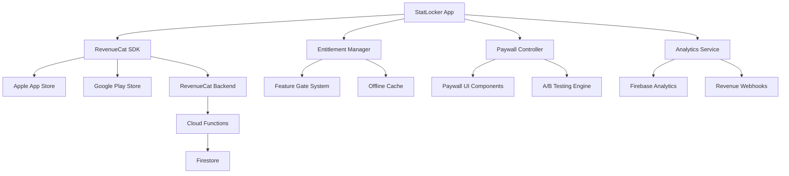

# Design Document

## Overview

The RevenueCat paywall integration provides a comprehensive subscription management system for StatLocker, featuring a 7-day free trial, Pro/Elite tiers, promotional offers, and robust error handling. The design emphasizes user experience, store compliance, and revenue optimization through A/B testing and contextual paywall triggers.

## Architecture

### High-Level Architecture



### Core Components

1. **EntitlementManager**: Central service managing subscription state and feature access
2. **PaywallController**: Handles paywall presentation logic and user flows
3. **SubscriptionService**: Wraps RevenueCat SDK with app-specific logic
4. **FeatureGateSystem**: Controls access to premium features
5. **AnalyticsService**: Tracks subscription funnel and revenue events

## Components and Interfaces

### EntitlementManager

```typescript
interface EntitlementManager {
  // Core entitlement checking
  hasEntitlement(feature: FeatureKey): Promise<boolean>
  getCurrentTier(): Promise<SubscriptionTier | null>
  isTrialActive(): Promise<boolean>
  getTrialTimeRemaining(): Promise<number | null>
  
  // Subscription management
  refreshEntitlements(): Promise<void>
  restorePurchases(): Promise<RestoreResult>
  
  // Event handling
  onEntitlementChange(callback: (entitlements: Entitlements) => void): void
}

interface Entitlements {
  pro: boolean
  elite: boolean
  family_member: boolean
  org_member: boolean
  trial_active: boolean
  trial_expires_at: Date | null
}
```

### PaywallController

```typescript
interface PaywallController {
  // Paywall presentation
  showPaywall(source: PaywallSource, context?: PaywallContext): Promise<void>
  dismissPaywall(): void
  
  // Purchase flow
  purchasePackage(packageId: string): Promise<PurchaseResult>
  startTrial(): Promise<TrialResult>
  
  // Configuration
  getOfferings(): Promise<Offerings>
  getPaywallVariant(): Promise<PaywallVariant>
}

type PaywallSource = 
  | 'locked_feature'
  | 'trial_expired'
  | 'dashboard_banner'
  | 'milestone_nudge'
  | 'settings'

interface PaywallContext {
  featureKey?: string
  milestone?: string
  customMessage?: string
}
```

### SubscriptionService

```typescript
interface SubscriptionService {
  // RevenueCat wrapper methods
  configure(apiKey: string): Promise<void>
  identify(userId: string): Promise<void>
  
  // Purchase operations
  getOfferings(): Promise<Offerings>
  purchasePackage(package: Package): Promise<PurchaseResult>
  restorePurchases(): Promise<RestoreResult>
  
  // Subscription state
  getCustomerInfo(): Promise<CustomerInfo>
  checkTrialEligibility(): Promise<boolean>
  
  // Event listeners
  onCustomerInfoUpdate(callback: (info: CustomerInfo) => void): void
}
```

## Data Models

### Subscription Tiers

```typescript
enum SubscriptionTier {
  FREE = 'free',
  PRO = 'pro',
  ELITE = 'elite',
  FAMILY = 'family',
  ORG = 'org'
}

interface SubscriptionInfo {
  tier: SubscriptionTier
  isActive: boolean
  expiresAt: Date | null
  isInGracePeriod: boolean
  isPaused: boolean
  willRenew: boolean
  originalPurchaseDate: Date
  latestPurchaseDate: Date
}
```

### Feature Mapping

```typescript
interface FeatureMap {
  [featureKey: string]: {
    requiredEntitlement: string[]
    abTestFlag?: string
    description: string
  }
}

// Example feature mapping
const FEATURE_MAP: FeatureMap = {
  'ai_insights': {
    requiredEntitlement: ['pro', 'elite', 'family_member', 'org_member'],
    description: 'AI-powered performance insights'
  },
  'advanced_analytics': {
    requiredEntitlement: ['elite', 'org_member'],
    description: 'Advanced statistical analysis'
  },
  'unlimited_ai_summaries': {
    requiredEntitlement: ['elite', 'org_member'],
    description: 'Unlimited AI game summaries'
  }
}
```

### Analytics Events

```typescript
interface PaywallAnalyticsEvent {
  event_name: string
  user_id: string
  timestamp: Date
  properties: {
    paywall_source: PaywallSource
    paywall_variant?: string
    experiment_id?: string
    feature_key?: string
    package_id?: string
    price?: number
    currency?: string
    error_code?: string
  }
}
```

## User Interface Design

### Paywall Screen Layout

```typescript
interface PaywallScreenProps {
  source: PaywallSource
  context?: PaywallContext
  offerings: Offerings
  variant: PaywallVariant
  onDismiss: () => void
  onPurchase: (packageId: string) => Promise<void>
}

// Paywall variants for A/B testing
type PaywallVariant = 'control' | 'feature_focused' | 'social_proof' | 'urgency'
```

### Component Hierarchy

```
PaywallScreen
├── PaywallHeader
│   ├── CloseButton
│   └── TrialBadge (if applicable)
├── PaywallContent
│   ├── HeroSection
│   ├── FeatureComparison
│   └── SocialProof (variant dependent)
├── SubscriptionOptions
│   ├── TrialOption (if eligible)
│   ├── ProTierOption
│   └── EliteTierOption
├── PaywallFooter
│   ├── RestorePurchasesButton
│   ├── TermsLinks
│   └── PricingDisclaimer
└── LoadingOverlay
```

### Feature Gate Components

```typescript
interface FeatureGateProps {
  featureKey: string
  fallback?: React.ReactNode
  children: React.ReactNode
}

interface PremiumFeatureBannerProps {
  featureKey: string
  title: string
  description: string
  ctaText?: string
  onUpgrade: () => void
}
```

## Error Handling

### Error Classification

```typescript
enum SubscriptionErrorType {
  NETWORK_ERROR = 'network_error',
  USER_CANCELLED = 'user_cancelled',
  PAYMENT_FAILED = 'payment_failed',
  RECEIPT_MISSING = 'receipt_missing',
  STORE_UNAVAILABLE = 'store_unavailable',
  INVALID_PRODUCT = 'invalid_product',
  UNKNOWN_ERROR = 'unknown_error'
}

interface SubscriptionError {
  type: SubscriptionErrorType
  message: string
  code?: string
  retryable: boolean
  userMessage: string
}
```

### Error Recovery Strategies

1. **Network Errors**: Automatic retry with exponential backoff, offline mode for cached entitlements
2. **User Cancellation**: Silent return to previous screen, no error logging
3. **Payment Failures**: Clear error message with retry option, support contact information
4. **Store Unavailability**: Graceful degradation with cached entitlements, background retry
5. **Receipt Issues**: Automatic restoration attempt, manual restore option

## Testing Strategy

### Unit Testing

```typescript
// EntitlementManager tests
describe('EntitlementManager', () => {
  test('should grant access for active pro subscription')
  test('should deny access when subscription expired')
  test('should handle trial period correctly')
  test('should cache entitlements for offline use')
  test('should refresh entitlements on app resume')
})

// PaywallController tests
describe('PaywallController', () => {
  test('should show correct variant based on A/B test')
  test('should track analytics events properly')
  test('should handle purchase flow completion')
  test('should restore purchases successfully')
})
```

### Integration Testing

```typescript
// RevenueCat integration tests
describe('RevenueCat Integration', () => {
  test('should configure SDK with correct API keys')
  test('should handle purchase flow end-to-end')
  test('should sync entitlements with backend')
  test('should handle webhook events correctly')
})
```

### E2E Testing Scenarios

1. **New User Trial Flow**: Onboarding → Trial activation → Feature access → Trial expiry → Paywall
2. **Purchase Flow**: Paywall presentation → Package selection → Purchase completion → Feature unlock
3. **Restore Flow**: App reinstall → Restore purchases → Entitlement verification → Feature access
4. **Error Scenarios**: Network failures, cancelled purchases, invalid receipts

## Performance Considerations

### Caching Strategy

```typescript
interface EntitlementCache {
  entitlements: Entitlements
  lastUpdated: Date
  expiresAt: Date
}

// Cache implementation
class EntitlementCacheManager {
  private cache: EntitlementCache | null = null
  
  async get(): Promise<Entitlements | null>
  async set(entitlements: Entitlements, ttl: number): Promise<void>
  async invalidate(): Promise<void>
  isExpired(): boolean
}
```

### Optimization Strategies

1. **Lazy Loading**: Load paywall components only when needed
2. **Entitlement Caching**: Cache entitlements with appropriate TTL
3. **Background Refresh**: Update entitlements in background on app resume
4. **Offline Support**: Respect cached entitlements when offline
5. **Bundle Size**: Tree-shake unused RevenueCat features

## Security Considerations

### Data Protection

1. **Receipt Validation**: Server-side receipt validation through RevenueCat
2. **Entitlement Verification**: Regular server-side entitlement checks
3. **Secure Storage**: Store sensitive data in encrypted storage
4. **API Security**: Secure webhook endpoints with proper authentication

### Privacy Compliance

1. **Data Minimization**: Collect only necessary subscription data
2. **User Consent**: Clear consent for data processing
3. **Data Retention**: Implement appropriate data retention policies
4. **GDPR Compliance**: Support data export and deletion requests

## Localization

### Supported Locales

- English (en-US) - Primary
- Spanish (es-ES, es-MX)
- French (fr-FR, fr-CA)
- German (de-DE)
- Portuguese (pt-BR)

### Localization Strategy

```typescript
interface PaywallStrings {
  title: string
  subtitle: string
  trialBadge: string
  features: {
    [key: string]: string
  }
  pricing: {
    monthly: string
    yearly: string
    trial: string
  }
  legal: {
    terms: string
    privacy: string
    restore: string
  }
}
```

## Analytics and Monitoring

### Key Metrics

1. **Conversion Funnel**: Paywall views → Trial starts → Purchases → Retention
2. **Revenue Metrics**: MRR, ARPU, LTV, churn rate
3. **Feature Usage**: Premium feature engagement by tier
4. **Error Rates**: Purchase failures, restoration issues, API errors

### Event Tracking

```typescript
// Core subscription events
const SUBSCRIPTION_EVENTS = {
  PAYWALL_SHOWN: 'paywall_shown',
  TRIAL_STARTED: 'trial_started',
  PURCHASE_COMPLETED: 'purchase_completed',
  SUBSCRIPTION_RENEWED: 'subscription_renewed',
  SUBSCRIPTION_CANCELLED: 'subscription_cancelled',
  FEATURE_BLOCKED: 'feature_blocked',
  RESTORE_COMPLETED: 'restore_completed'
} as const
```

## Deployment Strategy

### Environment Configuration

```typescript
interface RevenueCatConfig {
  apiKey: string
  environment: 'development' | 'staging' | 'production'
  offerings: {
    default: string
    family?: string
    org?: string
  }
  webhookUrl: string
}
```

### Feature Flags

```typescript
interface SubscriptionFeatureFlags {
  enableFamilyPlans: boolean
  enableOrgPlans: boolean
  enablePromotionalOffers: boolean
  paywallVariant: PaywallVariant
  trialLength: number // days
}
```

### Rollout Plan

1. **Phase 1**: Core subscription functionality (Pro/Elite tiers)
2. **Phase 2**: Promotional offers and A/B testing
3. **Phase 3**: Family and organizational plans
4. **Phase 4**: Advanced analytics and revenue optimization