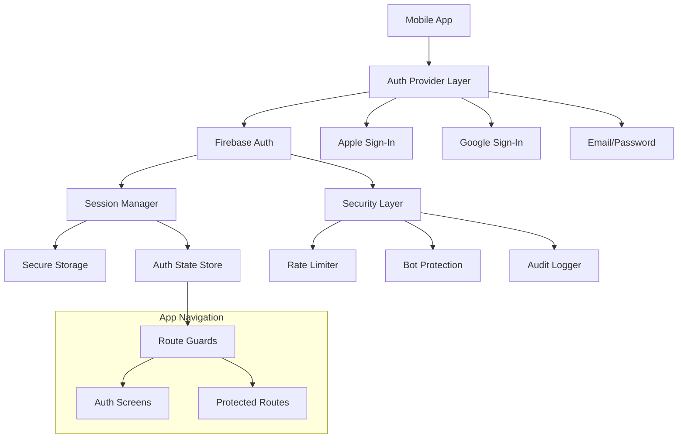
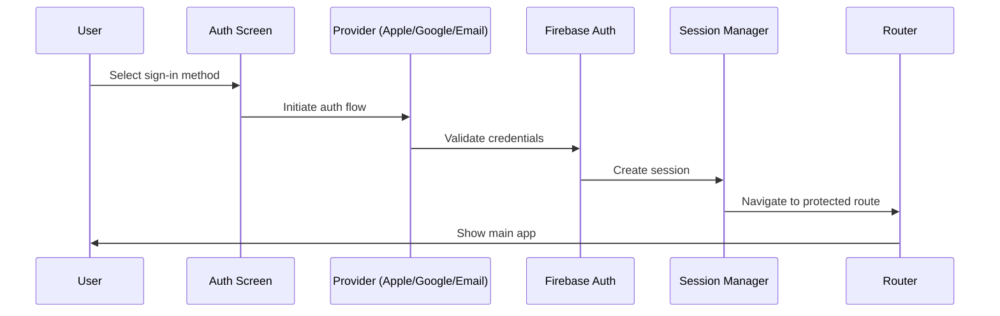

# Authentication System Design Document

## Overview

The Authentication System provides secure, multi-provider user authentication for StatLocker using Firebase Auth as the backend service. The system supports Apple Sign-In, Google Sign-In, and Email/Password authentication with comprehensive security features including session management, rate limiting, email verification, and account linking capabilities.

## Architecture

### High-Level Architecture



### Authentication Flow



## Components and Interfaces

### Core Components

#### 1. AuthProvider Component
- **Purpose**: Root-level authentication context provider
- **Responsibilities**:
  - Initialize Firebase Auth
  - Manage global auth state
  - Handle auth state persistence
  - Provide auth methods to child components

#### 2. AuthScreen Components
- **SignInScreen**: Main authentication entry point
- **SignUpScreen**: New user registration
- **ForgotPasswordScreen**: Password recovery flow
- **EmailVerificationScreen**: Email verification prompt

#### 3. Provider-Specific Components
- **AppleSignInButton**: Apple Sign-In integration
- **GoogleSignInButton**: Google Sign-In integration  
- **EmailPasswordForm**: Email/password form with validation

#### 4. Security Components
- **RateLimiter**: Prevents brute force attacks
- **BotProtection**: reCAPTCHA/device verification
- **AuditLogger**: Security event logging

#### 5. Session Management
- **SessionManager**: Handles session persistence and validation
- **AuthGuard**: Route protection component
- **ReauthModal**: Re-authentication for sensitive actions

### Interface Definitions

```typescript
// Core Auth Types
interface User {
  uid: string;
  email: string | null;
  emailVerified: boolean;
  displayName: string | null;
  photoURL: string | null;
  providers: AuthProvider[];
  createdAt: Date;
  lastSignIn: Date;
  consentVersion: string;
  parentalConsent?: boolean;
}

interface AuthState {
  user: User | null;
  loading: boolean;
  error: AuthError | null;
  isAuthenticated: boolean;
  sessionValid: boolean;
}

interface AuthProvider {
  providerId: 'apple.com' | 'google.com' | 'password';
  uid: string;
  email?: string;
}

// Auth Methods Interface
interface AuthService {
  // Sign-in methods
  signInWithApple(): Promise<UserCredential>;
  signInWithGoogle(): Promise<UserCredential>;
  signInWithEmail(email: string, password: string): Promise<UserCredential>;
  
  // Registration
  createUserWithEmail(email: string, password: string): Promise<UserCredential>;
  
  // Session management
  signOut(): Promise<void>;
  signOutAllDevices(): Promise<void>;
  getCurrentUser(): User | null;
  
  // Email verification
  sendEmailVerification(): Promise<void>;
  sendPasswordReset(email: string): Promise<void>;
  
  // Account management
  linkProvider(provider: AuthProvider): Promise<void>;
  unlinkProvider(providerId: string): Promise<void>;
  deleteAccount(): Promise<void>;
  
  // Re-authentication
  reauthenticate(credential: AuthCredential): Promise<void>;
  requireRecentAuth(maxAge: number): Promise<boolean>;
}

// Security Interfaces
interface RateLimitConfig {
  maxAttempts: number;
  windowMs: number;
  blockDurationMs: number;
}

interface SecurityEvent {
  type: 'auth_failed' | 'rate_limit' | 'suspicious_ip' | 'account_locked';
  userId?: string;
  ip: string;
  timestamp: Date;
  metadata: Record<string, any>;
}
```

## Data Models

### User Profile Schema (Firestore)
```typescript
interface UserProfile {
  // Core identity
  uid: string;
  email: string;
  emailVerified: boolean;
  displayName?: string;
  photoURL?: string;
  
  // Authentication metadata
  providers: AuthProvider[];
  createdAt: Timestamp;
  lastSignIn: Timestamp;
  lastActivity: Timestamp;
  
  // Security & compliance
  consentVersion: string;
  consentTimestamp: Timestamp;
  parentalConsent?: boolean;
  ageVerified: boolean;
  
  // Account status
  accountStatus: 'active' | 'suspended' | 'pending_verification';
  emailVerificationSent?: Timestamp;
  
  // Device management
  activeDevices: DeviceInfo[];
  
  // Privacy settings
  privacySettings: {
    dataProcessing: boolean;
    marketing: boolean;
    analytics: boolean;
  };
}

interface DeviceInfo {
  deviceId: string;
  platform: 'ios' | 'android';
  lastAccess: Timestamp;
  pushToken?: string;
}
```

### Security Event Schema
```typescript
interface SecurityEventLog {
  id: string;
  userId?: string;
  eventType: SecurityEventType;
  timestamp: Timestamp;
  ipAddress: string;
  userAgent: string;
  success: boolean;
  errorCode?: string;
  metadata: {
    provider?: string;
    attemptCount?: number;
    deviceInfo?: DeviceInfo;
  };
}
```

## Error Handling

### Error Classification System

```typescript
enum AuthErrorCode {
  // Network errors
  NETWORK_ERROR = 'auth/network-request-failed',
  TIMEOUT = 'auth/timeout',
  
  // Credential errors
  INVALID_EMAIL = 'auth/invalid-email',
  INVALID_PASSWORD = 'auth/wrong-password',
  USER_NOT_FOUND = 'auth/user-not-found',
  
  // Account state errors
  USER_DISABLED = 'auth/user-disabled',
  EMAIL_NOT_VERIFIED = 'auth/email-not-verified',
  ACCOUNT_EXISTS = 'auth/email-already-in-use',
  
  // Security errors
  RATE_LIMITED = 'auth/too-many-requests',
  WEAK_PASSWORD = 'auth/weak-password',
  REQUIRES_RECENT_LOGIN = 'auth/requires-recent-login',
  
  // Provider errors
  APPLE_CANCELLED = 'auth/apple-cancelled',
  GOOGLE_CANCELLED = 'auth/google-cancelled',
  PROVIDER_ALREADY_LINKED = 'auth/provider-already-linked',
  
  // Age/consent errors
  UNDERAGE_USER = 'auth/underage-user',
  PARENTAL_CONSENT_REQUIRED = 'auth/parental-consent-required'
}

interface AuthError {
  code: AuthErrorCode;
  message: string;
  userMessage: string; // Localized, user-friendly message
  retryable: boolean;
  requiresAction?: 'verify_email' | 'reset_password' | 'contact_support';
}
```

### Error Recovery Strategies

1. **Network Errors**: Automatic retry with exponential backoff
2. **Invalid Credentials**: Clear form, show specific error message
3. **Rate Limiting**: Show countdown timer, suggest alternative methods
4. **Provider Errors**: Fallback to email/password option
5. **Account Issues**: Direct to appropriate resolution flow

## Security Implementation

### Rate Limiting Strategy
- **Failed Sign-ins**: 5 attempts per 15 minutes per IP/device
- **Email Verification**: 3 sends per hour per user
- **Password Reset**: 3 requests per hour per email
- **Account Creation**: 3 attempts per hour per IP

### Bot Protection
- **iOS**: DeviceCheck integration for device attestation
- **Android**: SafetyNet API for device verification
- **Web**: reCAPTCHA v3 for suspicious activity detection

### Session Security
- **Token Rotation**: Refresh tokens rotated on each use
- **Device Binding**: Sessions tied to device fingerprints
- **Concurrent Sessions**: Maximum 5 active sessions per user
- **Session Timeout**: 30 days idle, 90 days absolute

### Privacy & Compliance
- **Data Minimization**: Collect only necessary user data
- **Consent Management**: Version-tracked consent with audit trail
- **Age Verification**: COPPA-compliant age gates
- **Right to Deletion**: Complete data purge within 30 days

## Testing Strategy

### Unit Testing
- **Auth Service Methods**: Mock Firebase Auth responses
- **Validation Logic**: Email format, password strength
- **Error Handling**: All error code paths
- **Rate Limiting**: Attempt counting and reset logic

### Integration Testing
- **Provider Flows**: End-to-end sign-in with test accounts
- **Session Persistence**: App restart scenarios
- **Account Linking**: Multiple provider combinations
- **Security Events**: Audit log generation

### Security Testing
- **Penetration Testing**: Rate limiting bypass attempts
- **Token Validation**: JWT signature verification
- **Session Hijacking**: Token theft scenarios
- **OWASP Compliance**: Authentication security checklist

### Performance Testing
- **Cold Start**: Initial auth state resolution time
- **Sign-in Latency**: Provider response times
- **Concurrent Users**: Session management under load
- **Offline Handling**: Cached auth state behavior

## User Interface Design

### Screen Specifications

#### 1. Sign In Screen (Default Entry)
**Goal**: Fast, trustworthy entry via SSO or email

**Layout (top→bottom)**:
- App wordmark + tiny lock badge
- Headline: "Stat tracking made easy. Progress made visible."
- Subtext: "Sign in to your Locker."
- Full-width button stack:
  - Continue with Apple
  - Continue with Google
  - Divider: "──────── or ────────"
- Email form:
  - Email field (autoFill, email keyboard)
  - Password field (toggle reveal, paste allowed)
  - Primary CTA: "Sign In"
- Secondary row: "New here? Create account" · "Forgot password?"
- Legal microcopy: "By continuing, you agree to the Terms & Privacy."
- System toast zone (top)

**Copy & States**:
- Empty state: "Pick a method to enter your Locker."
- Loading: "Signing you in…"
- Error mapping:
  - `wrong-password` → "That password didn't match. Try again or reset it."
  - `user-not-found` → "No account with that email yet. Create one?"
  - `too-many-requests` → "Too many attempts. Try again in a bit."

#### 2. Create Account Screen
**Goal**: Clear, low-friction new account creation

**Layout**:
- Headline: "Create your Locker"
- Subtext: "It takes less than a minute."
- Fields: Email, Password, Confirm Password
- Password strength meter + checklist:
  - "8+ chars", "1 number", "1 letter"
- Checkbox: "I agree to Terms & Privacy"
- Primary CTA: "Create account"
- Secondary: "Already have an account? Sign in"

#### 3. Forgot Password Screen
**Layout**:
- Headline: "Reset your password"
- Subtext: "Enter your email and we'll send a link."
- Field: Email
- CTA: "Send reset link"
- Success message: "Reset link sent. Check your inbox."
- Resend throttle UI with countdown

#### 4. Email Verification Screen
**Layout**:
- Illustration badge (mail with shield)
- Headline: "Verify your email"
- Body: "We sent a link to {email}. Tap it to continue."
- CTAs: "Open Mail App" · "Resend link"
- Link: "Change email"

#### 5. Re-authentication Modal
**Layout**:
- Title: "Confirm it's you"
- Tabs: Provider (Apple/Google) · Password
- CTA: "Confirm"

### Visual Design System

#### Typography
- **Display/Headers**: Outfit 600–700
- **Body/UI**: Satoshi (alt: Inter Tight) 400–500
- **Key Styles**:
  - Headline H2: Outfit 28/34, tracking -1%
  - Body: Satoshi 15/22
  - Button text: Satoshi 16/20, medium

#### Color Palette
- **Primary**: Royal Blue for primary CTAs
- **Success**: Aqua for checks/toasts
- **Warning**: Gold for limits
- **Danger**: Crimson for destructive actions
- **Surface Base**: White
- **Ink Title**: Off-White on dark surfaces
- **Body**: Cool/Silver Gray

#### Component Specifications
- **Primary Button**: filled, radius 14–16, shadow sm
- **Secondary Button**: outline, 1.25pt border
- **TextField**: soft border, 12 radius; focused ring 2px Royal Blue
- **Divider w/label**: center label "or"

#### Provider Buttons
- **Apple**: Black fill on light mode, Apple logo leading, "Continue with Apple"
- **Google**: White fill, gray border, Google logo, "Continue with Google"
- **Loading state**: replaces icon with spinner + "Signing in…"

### React Native Component Architecture

#### Core Components
```typescript
// Form Components
<SLTextField 
  label: string
  value: string
  onChange: (text: string) => void
  error?: string
  secure?: boolean
  autoCapitalize?: 'none' | 'sentences' | 'words' | 'characters'
  autoCorrect?: boolean
  textContentType?: string
/>

<SLButton 
  variant: 'primary' | 'secondary' | 'ghost'
  loading?: boolean
  icon?: ReactNode
  onPress: () => void
/>

<SLProviderButton 
  variant: 'apple' | 'google'
  onPress: () => void
  loading?: boolean
/>

// Feedback Components
<SLToast 
  type: 'success' | 'error' | 'info'
  message: string
  visible: boolean
  onDismiss: () => void
/>

<SLFormHint 
  text: string
  type: 'info' | 'success' | 'error'
/>

<SLDividerLabelled 
  label: string
/>
```

#### Styling with NativeWind
```typescript
// Spacing (Tailwind tokens)
const styles = {
  container: 'px-6',
  formStack: 'space-y-4',
  buttonStack: 'space-y-3',
  button: 'h-12 rounded-2xl',
  input: 'h-12 rounded-xl px-4',
  
  // Typography
  headline: 'text-2xl font-semibold tracking-tight',
  subtext: 'text-sm text-gray-500',
  
  // Buttons
  primaryBtn: 'h-12 rounded-2xl justify-center items-center shadow-sm bg-blue-600',
  googleBtn: 'h-12 rounded-2xl border border-gray-200 bg-white',
  
  // Inputs
  textInput: 'h-12 rounded-xl border border-gray-200 focus:border-blue-600 focus:ring-2 focus:ring-blue-600/30'
};
```

### Micro-interactions & Animation
- **Button press**: 90ms scale-in
- **Success feedback**: subtle check ✓ and 150ms fade to next screen
- **Screen transitions**: 180ms slide/fade
- **Form validation**: subtle shake for errors (8px amplitude, 120ms)
- **Success delight**: micro confetti (2 particles) on first sign-in

### Accessibility Requirements
- Minimum 44×44 tap targets
- VoiceOver labels for all interactive elements
- Dynamic Type support (max 120%)
- AA contrast compliance for all text and buttons
- Proper keyboard types and return key behavior
- Form submission on return key from password field

### Error Handling & Feedback
- **Network errors**: "We couldn't connect. Check your internet and try again."
- **Cancelled SSO**: "Sign-in was cancelled."
- **Rate limiting**: "Too many tries. Please wait {mm:ss}."
- **Toast behavior**: Auto-dismiss in 3.5s; critical errors persist until closed
- **Inline errors**: Show under fields with appropriate styling

### Copy Deck
```typescript
const authCopy = {
  signIn: {
    headline: "Stat tracking made easy. Progress made visible.",
    subtext: "Sign in to your Locker.",
    emptyState: "Pick a method to enter your Locker."
  },
  createAccount: {
    headline: "Create your Locker",
    subtext: "It takes less than a minute."
  },
  verifyEmail: {
    headline: "Verify your email",
    subtext: "We sent a link to {email}. Tap it to continue."
  },
  resetPassword: {
    headline: "Reset your password",
    subtext: "Enter your email and we'll send a link."
  }
};
```

## Implementation Phases

### Phase 1: Core Authentication (MVP)
- Firebase Auth setup and configuration
- Email/password authentication with UI
- Basic session management
- Route guards and navigation
- Core UI components and styling

### Phase 2: Social Providers
- Apple Sign-In integration with branded UI
- Google Sign-In integration with branded UI
- Provider account linking flows
- Enhanced error handling and user feedback

### Phase 3: Security Hardening
- Rate limiting implementation
- Bot protection integration
- Audit logging system
- Security monitoring and alerting

### Phase 4: Compliance & Polish
- Email verification flows with UI
- Age verification and consent management
- Account deletion and data export
- Advanced accessibility improvements
- Micro-interactions and animations

## Monitoring and Analytics

### Key Metrics
- **Authentication Success Rate**: By provider and overall
- **Session Duration**: Average and median session lengths
- **Error Rates**: Categorized by error type and provider
- **Security Events**: Failed attempts, rate limits, suspicious activity

### Alerting Thresholds
- **High Error Rate**: >5% authentication failures
- **Security Anomalies**: Unusual geographic patterns
- **Performance Degradation**: >3s authentication latency
- **Compliance Issues**: Underage user registrations

### Dashboard Requirements
- Real-time authentication metrics
- Security event timeline
- Provider performance comparison
- User journey funnel analysis